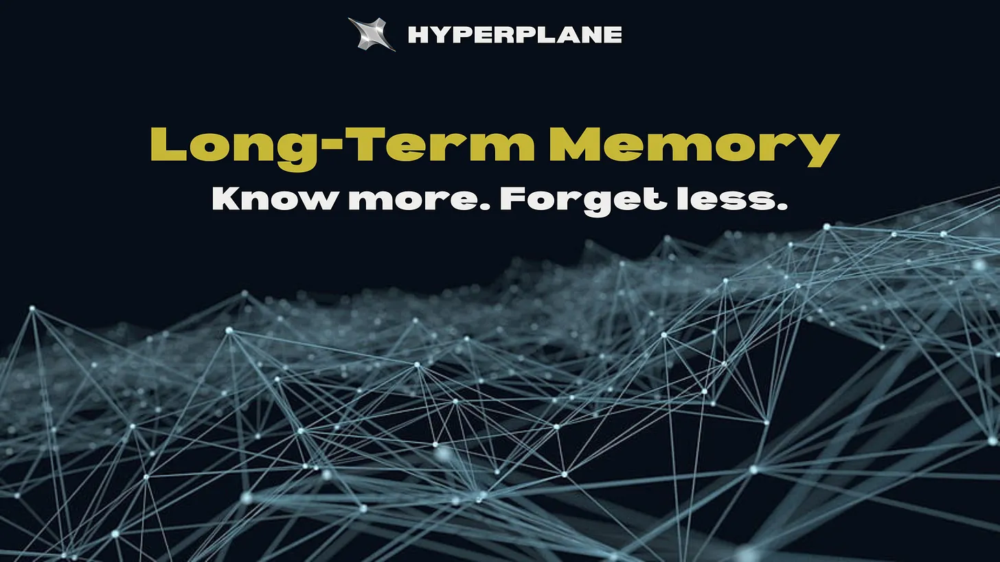
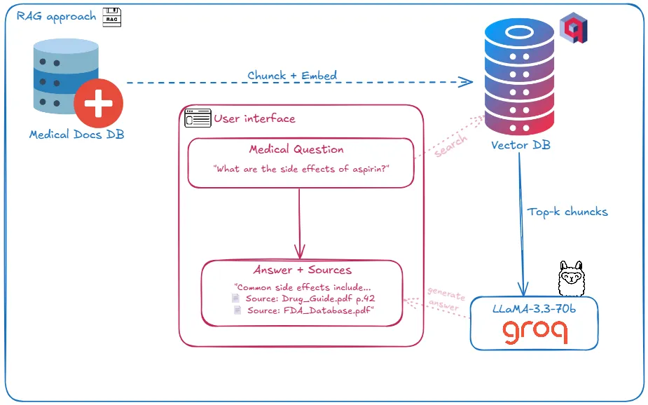

# Long-term memory series



## RAG approach



A simple Retrieval-Augmented Generation (RAG) app for medical documents using Streamlit, Qdrant, and Groq LLaMA 70B. Managed by [uv](https://github.com/astral-sh/uv).

### Implementation Summary

This application uses Streamlit for the front end and Qdrant as a vector database for storing and retrieving medical document embeddings. It uses Groq LLaMA 70B as the language model for generating answers. When a user queries the app and adds relevant documents to the chat, Qdrant retrieves the relevant documents using vector similarity and passes them, along with the query, to the Groq LLM to produce informed responses.

### Setup

1. Install [uv](https://github.com/astral-sh/uv) (if you do not have it):
   ```bash
   pip install uv
   ```

2. Install project dependencies:
   ```bash
   uv sync
   ```

3. Start your local Qdrant instance (see [Qdrant docs](https://qdrant.tech/documentation/quick-start/)).

4. Run the Streamlit app:
   ```bash
   streamlit run app.py
   ```

Set your `GROQ_API_KEY` in `.streamlit/secrets.toml` or as an environment variable.
